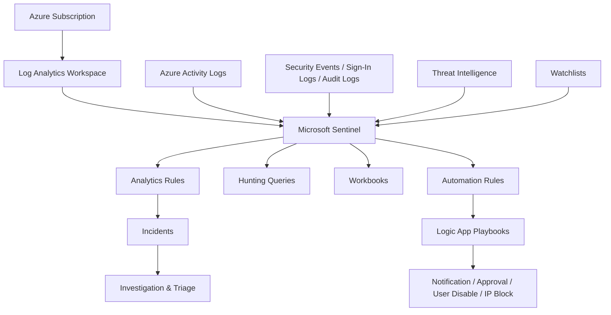

[Microsoft-Sentinel-Complete-README.md](https://github.com/user-attachments/files/27020290/Microsoft-Sentinel-Complete-README.md)
# Microsoft Sentinel SOC Lab Portfolio Project


## Project Overview

This repository is a hands-on **Microsoft Sentinel SOC project** designed to demonstrate practical security operations knowledge in a way that recruiters and hiring managers can understand quickly.

The goal of this project is to show that I can work through the same flow a real analyst follows in a SIEM environment:

- deploy and understand the Sentinel environment,
- connect relevant data sources,
- validate telemetry ingestion,
- write and tune KQL detections,
- investigate incidents,
- enrich detections with watchlists,
- think through threat intelligence use cases,
- and design automation with playbooks.

This project was inspired by a Microsoft Sentinel hands-on practice lab and expanded into a full portfolio case study so it reads like real SOC work rather than a short tutorial note.

---

## Why This Project Matters

A lot of entry-level cybersecurity candidates say they know Microsoft Sentinel, but fewer can actually show what they did inside it.

This project helps prove that I understand:

- how Sentinel fits into a SOC,
- the difference between data onboarding and detection engineering,
- how incidents are investigated,
- how KQL is used for threat hunting,
- how watchlists improve detection quality,
- and how automation can support response.

Instead of saying only **"I watched a Sentinel video"**, this repository shows a structured SOC workflow project with technical detail.

---

## Core Skills Demonstrated

| Area | Demonstrated Capability |
|---|---|
| SIEM Engineering | Workspace setup, Microsoft Sentinel onboarding, visibility validation |
| Data Ingestion | Connecting log sources and checking health of telemetry |
| Detection Engineering | Building and tuning KQL-based analytics logic |
| Threat Hunting | Investigating suspicious behavior across log data |
| Incident Response | Triage, evidence review, ownership, classification, documentation |
| Enrichment | Watchlists and threat intelligence concepts |
| SOAR | Playbook design with Logic Apps |
| Security Reporting | Dashboards, workbooks, operational visibility |
| Communication | GitHub documentation, case summaries, recruiter-ready writeups |

---

## Tools and Technologies

- **Microsoft Sentinel**
- **Azure Log Analytics Workspace**
- **Kusto Query Language (KQL)**
- **Azure Activity Logs**
- **SigninLogs / AuditLogs / SecurityEvent**
- **Watchlists**
- **Threat Intelligence**
- **Analytics Rules**
- **Incidents**
- **Workbooks**
- **Azure Logic Apps / Playbooks**

---

## Project Objectives

This project was built to demonstrate the following:

1. Enable a Microsoft Sentinel lab environment.
2. Connect log sources and confirm telemetry ingestion.
3. Create and test useful KQL detections.
4. Understand how analytics rules generate incidents.
5. Practice alert triage and investigation workflow.
6. Use watchlists to support tuning and enrichment.
7. Apply threat hunting logic to suspicious events.
8. Document a realistic automation / containment workflow.
9. Present the project in a GitHub-friendly format for recruiters.

---

## Architecture Overview



---

## Screenshots


### Microsoft Sentinel Overview Dashboard

<p align="center">
  
</p>

### Incident Queue / Triage View

<p align="center">
  
</p>

### Workbook / Reporting View

<p align="center">
  
</p>

### Logic App Playbook Flow

<p align="center">
  
</p>

---

## End-to-End Lab Walkthrough

## Phase 1: Workspace Setup and Sentinel Enablement

The first step in the lab is creating or selecting a **Log Analytics workspace** and enabling **Microsoft Sentinel** on top of it.

This matters because Sentinel relies on the workspace for:

- log storage,
- query execution,
- analytics rules,
- investigations,
- and workbooks.

### What I learned in this phase

- Microsoft Sentinel is not just a dashboard. It depends on Azure resources and proper setup.
- The workspace is the core data layer behind detections and investigations.
- Before building detections, the environment itself must be working correctly.

### What I would capture as evidence in a live lab

- resource group creation,
- workspace deployment,
- Sentinel onboarding status,
- subscription and region used,
- portal screenshots of the enabled environment.

---

## Phase 2: Data Connectors and Telemetry Ingestion

After Sentinel is enabled, the next important step is connecting data sources.

A SIEM is only as useful as the quality and relevance of the telemetry it receives.

### Data source mindset

When I connect a source, I think about:

- what table it populates,
- what detections it enables,
- what permissions or prerequisites are required,
- how much signal vs noise it will create,
- and whether the data is actually useful for security investigation.

### Example connector types explored

- Azure Activity
- Sign-in and identity logs
- Audit logs
- Security events
- Microsoft security alerts
- Threat intelligence sources

### What I validate after onboarding data

- the connector shows as connected or healthy,
- logs are arriving in the expected tables,
- timestamps are recent,
- and I can query the data successfully.

### What this shows a recruiter

It shows I understand that data ingestion comes before detection engineering, and that connector quality directly affects SOC visibility.

---

## Phase 3: Analytics Rules and Detection Engineering

This is where Sentinel becomes operational. Raw logs become actionable detections.

### My detection workflow

1. Identify suspicious behavior.
2. Choose the correct table.
3. Write the KQL query.
4. Test the query in Logs.
5. Convert it to a scheduled analytics rule.
6. Set severity, frequency, and grouping.
7. Tune out known noise.

### Detection ideas covered in this project

- repeated failed sign-ins from one IP,
- disabled account sign-in attempts,
- new user creation followed by role assignment,
- events that do not match a trusted allow-list.

### Why this matters

This shows I can think like a junior detection engineer instead of only clicking through built-in content.

---

## Phase 4: Incident Triage and Investigation

Once alerts become incidents, the work shifts into case handling.

### Questions I ask during triage

- What rule created the incident?
- Is the severity appropriate?
- What users, IPs, or hosts are involved?
- Does the evidence suggest real malicious activity?
- Is the case isolated, duplicated, or part of a wider pattern?

### Typical analyst actions in Sentinel

- assign ownership,
- update status,
- add comments,
- add tags,
- review evidence and entities,
- classify the incident,
- escalate or close with notes.

### Why incident documentation matters

Clear notes are part of real SOC work. Another analyst should be able to understand why the case was escalated, contained, or closed.

---

## Phase 5: Threat Hunting with KQL

Threat hunting goes beyond waiting for alerts. It involves searching proactively for suspicious behavior.

### Hunting mindset used in this project

- pivot from entities discovered in incidents,
- widen time windows to look for related activity,
- compare behavior across users and hosts,
- look for patterns that may not yet have generated alerts,
- and validate whether one alert is part of a broader compromise.

### Example hunting hypotheses

- a single source IP may be performing password spraying,
- disabled accounts may still be targeted by automation or attackers,
- newly created accounts may be escalated too quickly,
- trusted sources should be separated from suspicious ones.

---

## Phase 6: Watchlists for Enrichment and Tuning

Watchlists add context to detections and investigations.

### Example watchlist use cases

- privileged users,
- sensitive systems,
- trusted scanner IPs,
- approved VPN egress IPs,
- known suspicious indicators.

### Why watchlists matter

A good SOC needs to reduce false positives without losing visibility. Watchlists help distinguish normal business activity from high-risk activity.

---

## Phase 7: Threat Intelligence Concepts

Threat intelligence can be used to enrich logs and prioritize suspicious events.

### How I think about TI in Sentinel

- correlate observed IPs or domains with known indicators,
- use TI hits to raise analyst priority,
- combine TI with investigation context,
- and avoid treating all indicator matches as automatically malicious.

---

## Phase 8: Automation and Playbooks

The final stage is response maturity.

### Playbook design thinking

A good playbook should:

- trigger on meaningful conditions,
- notify the right people,
- leave an audit trail,
- support approvals for risky actions,
- and only automate containment where it is safe to do so.

### Example response flow

- Sentinel incident created,
- analyst or SOC channel notified,
- approval requested,
- user disabled or IP blocked,
- incident updated with response notes.

This demonstrates understanding of **SIEM + SOAR**, not just alert viewing.

---

## KQL Queries Included in This Project

## 1) Failed Logons by Source IP

```kusto
// Failed logons by source IP
// Useful for spotting brute force or password spray behavior.
SecurityEvent
| where TimeGenerated > ago(24h)
| where EventID == 4625
| extend SourceIp = tostring(IpAddress)
| extend Account = tostring(TargetUserName)
| summarize FailedAttempts=count(),
            FirstSeen=min(TimeGenerated),
            LastSeen=max(TimeGenerated),
            TargetedAccounts=make_set(Account, 20),
            Hosts=make_set(Computer, 20)
    by SourceIp
| where FailedAttempts >= 10
| where isnotempty(SourceIp)
| order by FailedAttempts desc
```

### Why I included it

This query helps detect password spraying, brute force attempts, or repeated authentication failures coming from a single source.

---

## 2) New User Followed by Role Assignment

```kusto
// New user followed by role assignment within 24 hours
// Useful for spotting suspicious privilege escalation after account creation.
AuditLogs
| where TimeGenerated > ago(7d)
| where OperationName == "Add user"
| project AddedTime = TimeGenerated,
          UserPrincipalName = tostring(TargetResources[0].userPrincipalName)
| join kind=inner (
    AzureActivity
    | where TimeGenerated > ago(7d)
    | where OperationNameValue =~ "MICROSOFT.AUTHORIZATION/ROLEASSIGNMENTS/WRITE"
       or OperationName =~ "Create role assignment"
    | project RoleAssignmentTime = TimeGenerated,
              Caller,
              OperationName,
              ResourceGroup,
              SubscriptionId
) on $left.UserPrincipalName == $right.Caller
| where RoleAssignmentTime between (AddedTime .. AddedTime + 1d)
| project AddedTime, RoleAssignmentTime, UserPrincipalName, OperationName, ResourceGroup, SubscriptionId
| order by RoleAssignmentTime desc
```

### Why I included it

This helps identify suspicious identity provisioning or fast privilege escalation after account creation.

---

## 3) Disabled Accounts Still Receiving Sign-In Attempts

```kusto
// Sign-in attempts against disabled accounts
// Useful for investigating stale credentials, attacker re-use, or noisy automation.
SigninLogs
| where TimeGenerated > ago(7d)
| where ResultDescription has_any ("account is disabled", "disabled")
    or Status has_any ("account is disabled", "disabled")
| summarize Attempts=count(),
            FirstSeen=min(TimeGenerated),
            LastSeen=max(TimeGenerated),
            Applications=make_set(AppDisplayName, 20),
            Locations=make_set(Location, 20)
    by IPAddress, UserPrincipalName
| order by Attempts desc
```

### Why I included it

Disabled accounts should not normally be active authentication targets. This can reveal attacker reuse of old credentials or broken internal automation.

---

## 4) Watchlist Allow-List Example

```kusto
// Watchlist allow-list example
// Replace 'trusted-ip-allowlist' with your actual watchlist alias.
let AllowedIPs =
    _GetWatchlist('trusted-ip-allowlist')
    | project SearchKey;
SigninLogs
| where TimeGenerated > ago(24h)
| where isnotempty(IPAddress)
| join kind=leftanti AllowedIPs on $left.IPAddress == $right.SearchKey
| summarize FailedOrRiskyEvents=count() by IPAddress, UserPrincipalName, AppDisplayName
| order by FailedOrRiskyEvents desc
```

### Why I included it

This shows how watchlists can be used to reduce alert fatigue while preserving visibility into untrusted sources.

---

## Sample Watchlists

## High-Risk IP Watchlist

```csv
SearchKey,Description,Owner,Priority
185.220.101.1,Tor exit node sample,ThreatIntel,High
45.95.147.34,Suspicious authentication source sample,SOC,High
103.86.99.12,Unapproved external address sample,SOC,Medium
```

## Privileged Users Watchlist

```csv
SearchKey,DisplayName,Department,Criticality
admin01@contoso.com,Domain Admin Account,Infrastructure,High
secops.lead@contoso.com,Security Operations Lead,Security,High
azure.owner@contoso.com,Azure Subscription Owner,Cloud,High
```

---

## Sample Incident Summary

```markdown
# Sample Incident Summary

## Incident Title
Suspicious Sign-In Attempts Against Disabled Accounts

## Severity
Medium

## Summary
Multiple authentication attempts were observed against one or more disabled accounts. The pattern may indicate stale credential use, attacker knowledge of historic identities, or noisy automated processes attempting to authenticate with invalid account states.

## Initial Evidence Reviewed
- sign-in failure descriptions
- source IP addresses
- affected user accounts
- time window and repetition pattern
- related applications involved in the sign-in attempts

## Analyst Assessment
The activity is suspicious because disabled accounts should not be valid authentication targets during normal operations. Repeated attempts warrant validation of the source system or user behavior behind the traffic.

## Recommended Next Actions
1. Validate whether the source IP belongs to a trusted internal process.
2. Review whether the affected accounts are tied to decommissioned services.
3. Check for additional sign-in or enumeration activity from the same source.
4. Escalate if the source is external, repeated, or associated with other authentication anomalies.

## Containment Considerations
- block or monitor the source IP if malicious intent is confirmed,
- notify identity administrators if an internal process is misconfigured,
- tune the detection only after root cause is understood.

## Closing Note Example
Incident reviewed and documented. Further validation required to determine whether the source is malicious or a legacy internal process using stale credentials.
```

---

## Detection Philosophy

I approached this project as both a **Microsoft Sentinel learning lab** and a **SOC portfolio project**.

The goal was not to generate a huge number of noisy detections. The goal was to demonstrate that I can:

- translate a suspicious behavior into a query,
- think through why the behavior matters,
- understand false positives,
- investigate the output,
- and document what should happen next.

---

## Incident Handling Mindset

When I review an incident, I focus on:

1. what triggered it,
2. how severe it appears,
3. which entity matters most,
4. whether the evidence supports escalation,
5. and what containment action should be considered.

This mirrors the basic workflow of a SOC analyst using Microsoft Sentinel in a real environment.

---

## MITRE ATT&CK Mindset

I tried to think in terms of attacker behavior rather than just raw events.

Examples of ATT&CK-style reasoning relevant to this project include:

- **Credential Access** through repeated failed sign-ins,
- **Privilege Escalation** through rapid role assignment after user creation,
- **Persistence** through suspicious account provisioning,
- **Discovery** through suspicious logon behavior and repeated probing,
- **Defense Evasion** where approved sources must be separated from suspicious ones.

---

## Recruiter Value

This project helps demonstrate that I can:

- explain what Microsoft Sentinel is,
- onboard and validate data sources,
- write and tune KQL,
- create useful detection logic,
- investigate incidents with analyst thinking,
- document case notes clearly,
- and understand the connection between SIEM and SOAR.

This makes the project stronger than a basic note saying only that I used Sentinel once.

---

## Resume Bullets

- Built and documented a hands-on Microsoft Sentinel SOC lab covering workspace onboarding, data connectors, KQL detections, threat hunting, incident triage, watchlists, threat intelligence, workbooks, and playbook design.
- Created KQL queries to detect suspicious authentication activity, disabled-account sign-ins, and identity-to-privilege escalation patterns in Microsoft Sentinel.
- Practiced Microsoft Sentinel incident handling by reviewing severity, evidence, entities, ownership, classification, and case documentation.
- Used watchlist and tuning concepts to separate trusted activity from suspicious behavior and reduce alert noise.
- Designed a Microsoft Sentinel SOAR workflow using Azure Logic Apps for analyst notification, approval-based containment, user disabling, and IP blocking.

---

## Interview Talking Points

### What did you actually do in Microsoft Sentinel?
I set up the lab environment, reviewed data connectors, used KQL for detections and hunting, investigated the type of incidents Sentinel can generate, and documented how a playbook-based response would work.

### What part was most valuable?
Writing and understanding the KQL was the most valuable part because it forced me to think about attacker behavior, alert quality, and false-positive reduction.

### How did you show incident handling?
I documented ownership, severity review, evidence analysis, classification, and the type of notes that would be left for escalation or closure.

### Why include playbooks and workbooks?
Because security operations is more than looking at alerts. It also includes reporting, visibility, communication, and repeatable response processes.

---

## How I Would Improve This Project Further

To make this project even stronger over time, I would:

1. replace the starter screenshots with images from my own Azure tenant,
2. export real custom analytics rules from the lab,
3. add more KQL hunts and tuning examples,
4. document one real false positive and how I tuned it,
5. add a short screen recording showing a rule firing and an incident opening,
6. build a Defender portal version as Microsoft continues the Sentinel transition.

---

## Repository Structure

```text
microsoft-sentinel-portfolio-project/
├── README.md
├── assets/
│   └── images/
│       ├── dashboard.png
│       ├── incident-grid.png
│       ├── incidents.png
│       ├── logic-app.png
│       └── workbook-graph.png
├── docs/
│   ├── 01_lab_walkthrough.md
│   ├── 02_detection_and_hunting.md
│   ├── 03_incident_response_and_playbooks.md
│   ├── 04_recruiter_notes.md
│   └── 05_image_attribution.md
├── kql/
│   ├── 01_failed_logons_by_ip.kql
│   ├── 02_new_user_followed_by_role_assignment.kql
│   ├── 03_disabled_accounts_signins.kql
│   └── 04_watchlist_allowlist_example.kql
├── reports/
│   └── sample-incident-summary.md
└── watchlists/
    ├── high-risk-ip-addresses.csv
    └── privileged-users.csv
```

---


---

## References

- Video inspiration: `https://www.youtube.com/watch?v=NJlaqBaqahc`
- Microsoft Sentinel official documentation: `https://learn.microsoft.com/en-us/azure/sentinel/`
- Microsoft Sentinel training lab content: `https://github.com/Azure/Azure-Sentinel/tree/master/Solutions/Training/Azure-Sentinel-Training-Lab`
- Image attribution notes: `docs/05_image_attribution.md`
