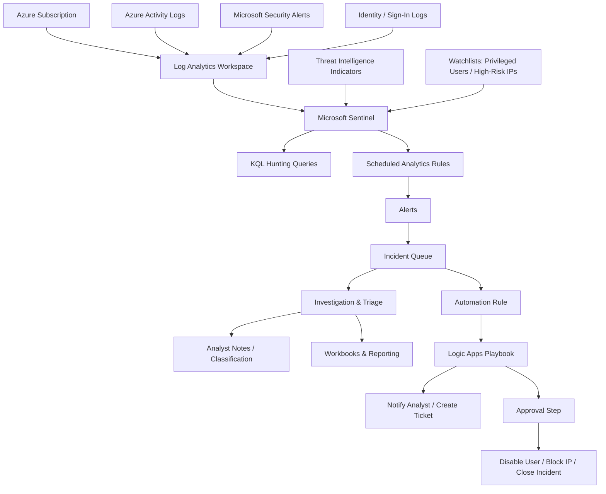

# Microsoft Sentinel SOC Lab — SIEM Detection, Investigation & SOAR Portfolio


---

## Executive Summary

This project documents a hands-on Microsoft Sentinel SOC lab built to show how I would approach a real Tier 1 / junior SOC analyst workflow: collecting security data, creating detections, reviewing incidents, hunting with KQL, enriching alerts with watchlists, and designing a basic SOAR response process.

The goal was not only to “set up Sentinel,” but to understand how each part of the SOC workflow connects:

- **Log Analytics Workspace** stores the security telemetry.
- **Microsoft Sentinel** turns the workspace into a SIEM/SOAR environment.
- **Data connectors** bring in activity, identity, and security alert data.
- **KQL queries** help detect suspicious behavior.
- **Analytics rules** convert suspicious patterns into alerts and incidents.
- **Watchlists and threat intelligence** add context during triage.
- **Workbooks** support reporting and visibility.
- **Logic Apps playbooks** support repeatable response actions.

This repository is written as a portfolio case study for recruiters and SOC hiring managers. It focuses on the thinking process behind the lab, not just screenshots.

> **Originality note:** This project was inspired by beginner Microsoft Sentinel lab material and Microsoft’s official training resources, but the structure, explanations, analyst notes, detection logic, and investigation write-up are written as an original portfolio project. Any third-party screenshots or learning references should remain credited in `docs/05_image_attribution.md`. For the strongest version, replace the placeholder/reference screenshots with screenshots from your own Azure tenant.

---

## What I Wanted to Prove

A lot of beginner cybersecurity projects show that a tool was opened. I wanted this project to show that I understand the workflow behind the tool.

This lab demonstrates that I can:

1. explain where Sentinel fits inside a SOC environment,
2. onboard a Log Analytics workspace,
3. connect security-relevant data sources,
4. validate that logs are being collected,
5. write KQL queries for detection and hunting,
6. convert detection logic into analytics rules,
7. triage incidents using severity, entities, and evidence,
8. enrich investigations with watchlists and threat intelligence,
9. document findings in a clear incident report,
10. design a simple SOAR playbook for repeatable response.

---

## Lab Scenario

The lab is based on a small cloud SOC environment where Microsoft Sentinel is used to monitor suspicious activity and support incident response.

The main scenario used throughout the project is:

> A SOC analyst receives alerts related to suspicious authentication activity and possible account misuse. The analyst reviews the incident, checks the affected account and source IPs, validates whether the behavior looks abnormal, documents findings, and recommends containment actions.

This scenario was chosen because failed sign-ins, suspicious account behavior, and privilege changes are common areas junior SOC analysts are expected to understand.

---

## Architecture Overview



### Architecture Explanation

The environment starts with an Azure subscription and a Log Analytics Workspace. Microsoft Sentinel is enabled on top of that workspace, allowing the collected logs to be used for detection, investigation, hunting, and automation.

The key idea is simple: **Sentinel is only useful when the right data is connected and the detections are tuned to meaningful behavior.**

---

## Tools and Services Used

| Category | Tool / Service | Purpose |
|---|---|---|
| SIEM / SOAR | Microsoft Sentinel | Incident detection, triage, hunting, and response |
| Log Storage | Log Analytics Workspace | Central log collection and query layer |
| Query Language | KQL | Detection logic, hunting, and investigation |
| Cloud Platform | Microsoft Azure | Lab environment and resource management |
| Automation | Azure Logic Apps | Playbook response design |
| Enrichment | Watchlists | Known IPs, privileged accounts, and allowlists |
| Reporting | Sentinel Workbooks | Dashboards and operational visibility |
| Framework | MITRE ATT&CK | Mapping suspicious activity to attacker behavior |

---

## Skills Demonstrated

| Area | What This Project Shows |
|---|---|
| SIEM Fundamentals | Workspace setup, Sentinel enablement, incident queue review |
| Data Ingestion | Understanding connector health and log visibility |
| Detection Engineering | KQL logic, scheduled rules, severity, thresholding, tuning |
| Incident Response | Triage flow, evidence review, classification, containment recommendation |
| Threat Hunting | Proactive searching for suspicious authentication and account activity |
| Watchlist Enrichment | Comparing events against high-risk users, IPs, and allowlists |
| Threat Intelligence | Understanding how indicators can support investigation context |
| Reporting | Using workbooks to summarize incidents, connector health, and trends |
| SOAR | Designing a playbook with notification, approval, and containment steps |
| Documentation | Writing clear analyst notes, README sections, and incident reports |

---

## Lab Screenshots

### 1. Sentinel Overview Dashboard

<p align="center">
  
</p>

This view represents the starting point for SOC monitoring. From here, an analyst can quickly review the health of the workspace, recent incidents, connector activity, automation status, and overall visibility.

**Analyst takeaway:**  
Before investigating alerts, I would first confirm that the workspace is receiving data and that Sentinel is not showing obvious connector or ingestion issues.

---

### 2. Incident Queue and Triage View

<p align="center">
  
</p>

The incident queue is where alerts become analyst work. This is where severity, status, owner, entities, tactics, and alert evidence help determine what should be investigated first.

**How I would triage from this view:**

1. Sort incidents by severity and creation time.
2. Open the newest high or medium severity incidents first.
3. Review affected users, hosts, IP addresses, and related alerts.
4. Add comments during investigation so the next analyst can follow the reasoning.
5. Close only after classification and evidence review.

---

### 3. Workbook / Security Reporting View

<p align="center">
  
</p>

Workbooks help turn raw security data into dashboards. They are useful for reporting incident trends, authentication behavior, connector health, rule performance, and analyst workload.

**Analyst takeaway:**  
A workbook is not just a visual report. In a SOC, it can help identify noisy rules, repeated failed sign-ins, high-risk accounts, and gaps in data collection.

---

### 4. Logic App Playbook Response Flow

<p align="center">
  
</p>

This represents a simple SOAR workflow that could be triggered from a Sentinel incident.

Example response flow:

1. Sentinel incident is created.
2. Automation rule triggers the playbook.
3. Analyst or SOC channel receives a notification.
4. A ticket or tracking record is created.
5. Approval is requested before containment.
6. If approved, the response action is executed.
7. Incident is updated with a comment or status change.

---

## Walkthrough

## Phase 1 — Workspace and Sentinel Setup

The first step was to prepare the SIEM foundation. Microsoft Sentinel requires a Log Analytics Workspace because the workspace stores the log data that Sentinel queries and analyzes.

**What I configured / reviewed**

- Azure subscription structure
- Log Analytics Workspace deployment
- Microsoft Sentinel enablement
- basic workspace validation
- relationship between Sentinel and Log Analytics

**What I learned**

Sentinel is not a separate isolated tool. It depends heavily on the data inside the Log Analytics Workspace. If logs are missing, delayed, or poorly scoped, the incident queue will not tell the full story.

---

## Phase 2 — Data Connectors and Log Visibility

After enabling Sentinel, the next step was to understand data connectors. A SIEM without useful data is just an empty dashboard.

**Connectors explored in the lab path**

- Azure Activity
- Microsoft security alert sources
- identity and sign-in related logs
- threat intelligence inputs

**Validation mindset**

When connecting a source, I would not assume it is working just because it is enabled. I would check:

- whether data is actually arriving,
- which table the logs are stored in,
- whether the time range is correct,
- whether the connector has any configuration warnings,
- whether the collected logs match the detection use case.

**Recruiter value**

This shows that I understand the difference between **connecting a data source** and **having useful telemetry for detection**.

---

## Phase 3 — KQL Detection Logic

KQL is the part of the project that shows actual analyst thinking. Instead of relying only on built-in templates, I documented custom queries that can support detection and hunting.

### Example Detection: New User Followed by Role Assignment

```kusto
AuditLogs
| where OperationName == "Add user"
| project AddedTime = TimeGenerated, user = tostring(TargetResources[0].userPrincipalName)
| join (
    AzureActivity
    | where OperationName == "Create role assignment"
    | project OperationName, RoleAssignmentTime = TimeGenerated, user = Caller
) on user
| where RoleAssignmentTime between (AddedTime .. AddedTime + 1d)
| project AddedTime, RoleAssignmentTime, user, OperationName
```

### Detection Purpose

This query looks for a user account creation followed by a role assignment within a short time window. In some environments this may be normal administration, but it can also be a signal of suspicious account creation, persistence, or privilege escalation.

### Data Sources

- `AuditLogs`
- `AzureActivity`

### Logic

The query first identifies newly added users. It then joins those users with role assignment activity and checks whether the role assignment happened within 24 hours of the user being added.

### Expected Result

The result should show:

- the time the user was added,
- the time the role assignment occurred,
- the user involved,
- the operation name.

### Possible False Positives

This query may trigger during:

- planned onboarding,
- admin account creation,
- temporary project access,
- lab testing,
- identity team maintenance.

### SOC Analyst Action

If this detection fired in a real SOC, I would:

1. confirm whether the account creation was approved,
2. check who created the account,
3. review the role that was assigned,
4. check whether the account signed in shortly after creation,
5. escalate if the activity was not expected or not documented.

---

## Phase 4 — Analytics Rules

After writing KQL logic, the next step was understanding how to turn a query into an analytics rule.

**Rule design considerations**

| Rule Setting | Why It Matters |
|---|---|
| Query frequency | Controls how often Sentinel checks for the behavior |
| Lookup period | Defines how far back Sentinel searches each time |
| Severity | Helps analysts prioritize incidents |
| Entity mapping | Links users, IPs, hosts, or accounts to the incident |
| MITRE tactics | Shows the attacker behavior category |
| Threshold | Prevents one-off noise from becoming unnecessary incidents |
| Suppression | Helps reduce repeated alerts from the same known activity |

**Analyst takeaway**

A detection is not finished when the KQL runs successfully. It still needs rule logic, severity, entity mapping, tuning, and documentation so another analyst can understand why it exists.

---

## Phase 5 — Incident Triage

Once an analytics rule fires, the work moves into incident handling.

### My Triage Process

1. **Open the incident**  
   Review the title, severity, status, provider, and creation time.

2. **Check entities**  
   Identify the user, IP address, host, or application involved.

3. **Review evidence**  
   Look at related alerts, timestamps, event count, and query results.

4. **Validate context**  
   Compare the activity with expected business behavior, watchlists, and known admin activity.

5. **Decide severity**  
   Determine whether the incident should remain as-is, be escalated, or be downgraded.

6. **Document the investigation**  
   Add clear comments explaining what was checked and why the incident was classified a certain way.

7. **Recommend containment**  
   Suggest actions such as password reset, user disablement, IP block, MFA review, or further endpoint investigation.

---

## Phase 6 — Threat Hunting

Threat hunting in this project focuses on asking questions before an alert tells the analyst what to do.

Examples of hunting questions:

- Are there repeated failed sign-ins from the same IP?
- Are disabled accounts still attempting to authenticate?
- Was a new user quickly granted elevated access?
- Are privileged users showing activity from unexpected locations?
- Do any events match known high-risk IPs in a watchlist?

This mindset is important because SOC work is not only reacting to incidents. Analysts also need to search for suspicious patterns that may not yet have triggered an alert.

---

## Phase 7 — Watchlists

Watchlists were included to show how simple enrichment can improve investigations.

### Example Watchlist Use Cases

| Watchlist | Example Use |
|---|---|
| `privileged-users.csv` | Prioritize alerts involving admin or high-impact accounts |
| `high-risk-ip-addresses.csv` | Compare activity against known risky IPs |
| Allowlist | Reduce noise from approved scanners, VPNs, or admin systems |

**Analyst takeaway**

A watchlist can make a basic query more useful because it adds business context. The same failed login may be low priority for a test account but higher priority for a privileged account.

---

## Phase 8 — Threat Intelligence

Threat intelligence was included as part of the investigation workflow. In Sentinel, indicators such as IP addresses, domains, URLs, and hashes can help analysts compare internal activity against known suspicious infrastructure.

**How I would use threat intelligence**

- check whether an external IP has known malicious reputation,
- compare domains or URLs against known indicators,
- prioritize alerts involving risky indicators,
- avoid treating threat intel as final proof without internal evidence.

**Important note**

Threat intelligence should support investigation. It should not replace analyst judgment. A match may be useful, but I would still validate the affected account, timestamp, source, destination, and user activity.

---

## Phase 9 — SOAR Playbook Design

The SOAR part of this lab documents how a response could be standardized using Azure Logic Apps.

### Example Playbook Flow

```text
Sentinel Incident Created
        ↓
Automation Rule Runs
        ↓
Logic App Starts
        ↓
Send Teams / Email Notification
        ↓
Create Ticket or Tracking Record
        ↓
Request Analyst Approval
        ↓
If Approved: Disable User or Block IP
        ↓
Add Comment to Incident
        ↓
Update Incident Status
```

### Why Approval Matters

For a junior SOC workflow, I would not automatically disable users or block IP addresses without approval. A safer design is to notify, collect evidence, request approval, and then take action.

This shows a more realistic SOC approach because containment actions can affect business users and production systems.

---

## Detection and Hunting Files

### KQL Queries

- [`kql/01_failed_logons_by_ip.kql`](kql/01_failed_logons_by_ip.kql)
- [`kql/02_new_user_followed_by_role_assignment.kql`](kql/02_new_user_followed_by_role_assignment.kql)
- [`kql/03_disabled_accounts_signins.kql`](kql/03_disabled_accounts_signins.kql)
- [`kql/04_watchlist_allowlist_example.kql`](kql/04_watchlist_allowlist_example.kql)

### Watchlists

- [`watchlists/high-risk-ip-addresses.csv`](watchlists/high-risk-ip-addresses.csv)
- [`watchlists/privileged-users.csv`](watchlists/privileged-users.csv)

### Reports

- [`reports/sample-incident-summary.md`](reports/sample-incident-summary.md)

### Supporting Documentation

- [`docs/01_lab_walkthrough.md`](docs/01_lab_walkthrough.md)
- [`docs/02_detection_and_hunting.md`](docs/02_detection_and_hunting.md)
- [`docs/03_incident_response_and_playbooks.md`](docs/03_incident_response_and_playbooks.md)
- [`docs/04_recruiter_notes.md`](docs/04_recruiter_notes.md)
- [`docs/05_image_attribution.md`](docs/05_image_attribution.md)

---

## Sample Incident Report Summary

**Incident Name:** Multiple failed sign-in attempts from a single source IP  
**Severity:** Medium  
**Category:** Credential access / brute-force behavior  
**Affected Entity:** User account  
**Detection Source:** Microsoft Sentinel scheduled analytics rule  
**Data Source:** Sign-in or authentication logs  
**Status:** Investigated and documented

### Investigation Timeline

| Time | Activity |
|---|---|
| 09:10 | Multiple failed sign-ins observed from the same IP address |
| 09:15 | Sentinel analytics rule generated an alert |
| 09:18 | Incident created in Microsoft Sentinel |
| 09:25 | Analyst reviewed affected user, source IP, and event count |
| 09:32 | Watchlist and threat intelligence context checked |
| 09:40 | Containment recommendation documented |

### Analyst Findings

The failed sign-ins were concentrated around one user account and one source IP address. The pattern matched possible brute-force behavior because the number of failures was higher than expected within a short period.

### Recommended Actions

- confirm whether the user recognized the activity,
- reset password if activity was suspicious,
- review MFA status,
- block or monitor the source IP if confirmed malicious,
- check whether the same IP targeted other users,
- close the incident only after classification and documentation.

---

## MITRE ATT&CK Mapping

This project uses MITRE ATT&CK as a thinking framework, especially for understanding the behavior behind the alert.

| Tactic | How It Relates to This Lab |
|---|---|
| Initial Access | Suspicious sign-in attempts may indicate attempts to gain access |
| Credential Access | Repeated failed logins may suggest password guessing |
| Persistence | New account creation can be used to maintain access |
| Privilege Escalation | Role assignment after account creation may indicate elevated access |
| Discovery | Follow-up account activity may show enumeration or environment review |
| Defense Evasion | Abuse of valid accounts can make activity harder to detect |

I did not force every event into a MITRE label. I used MITRE where it helped explain the attacker behavior behind the detection.

---

## What Makes This Project Different

This project is not presented as a perfect enterprise deployment. It is presented as a realistic junior analyst lab with clear explanations of what was configured, what was investigated, and what I learned.

### Strong points

- focuses on SOC workflow, not only tool screenshots,
- includes KQL detection logic,
- explains possible false positives,
- connects detection to investigation steps,
- includes watchlist and threat intelligence context,
- documents SOAR response design,
- is written in a way a recruiter can scan quickly,
- includes deeper notes for technical reviewers.

### Limitations

- some screenshots may be reference screenshots unless replaced with personal tenant screenshots,
- the lab is not a production SOC environment,
- response actions are documented as a safe playbook design, not as uncontrolled automatic containment,
- detections would need tuning with real organizational baselines.

Being honest about limitations makes the project more credible.

---

## Finishing Tactics Added for Recruiter Impact

These are the improvements that make the project look more complete and less like a copied beginner lab:

### 1. Add a “What I Learned” Section

At the end of each document, include a few personal notes such as:

- what confused me at first,
- what I tested,
- what I would improve next,
- what I would ask a senior analyst before deploying the rule.

This makes the project sound more hands-on and less like pasted documentation.

### 2. Add Evidence of Tuning

For each detection, include a small note like:

> This rule may be noisy in environments with frequent onboarding. I would tune it by excluding approved identity administrators, narrowing the lookup window, and mapping only high-impact roles.

### 3. Add Analyst Comments

Include realistic comments an analyst would leave in Sentinel:

```text
Reviewed failed sign-in pattern for user account. Source IP generated repeated failures within a short time window. No successful login observed in the reviewed period. Recommended user verification and MFA review before closure.
```

### 4. Add Before/After Logic

Show that you did not just copy a query. Explain how it evolved:

```text
Initial idea: count failed sign-ins by user.
Improved logic: group by user and source IP, apply a threshold, then check whether the IP appears in a high-risk watchlist.
```

### 5. Add a Small Lessons Learned Section

Example:

- Detections are only useful when the data source is reliable.
- KQL needs context, not just syntax.
- Watchlists help reduce noise and prioritize high-risk entities.
- Automated response should include approval when business impact is possible.

### 6. Replace Generic Screenshots Over Time

The strongest improvement is to use your own screenshots from Azure, especially:

- Log Analytics query output,
- analytics rule creation page,
- incident queue,
- workbook view,
- playbook designer,
- watchlist upload screen.

### 7. Add Interview Talking Points

Use the project to prepare short explanations for interviews:

- “I used Sentinel to understand how SIEM data moves from ingestion to detection.”
- “I wrote KQL queries to detect suspicious account activity and documented false positives.”
- “I designed the playbook with approval because automatic containment can affect real users.”
- “I treated the project as a SOC workflow, not only a tool demonstration.”

---

## Repository Structure

```text
microsoft-sentinel-soc-lab/
├── README.md
├── assets/
│   └── images/
│       ├── dashboard.png
│       ├── incident-grid.png
│       ├── incidents.png
│       ├── logic-app.png
│       └── workbook-graph.png
├── docs/
│   ├── 01_lab_walkthrough.md
│   ├── 02_detection_and_hunting.md
│   ├── 03_incident_response_and_playbooks.md
│   ├── 04_recruiter_notes.md
│   └── 05_image_attribution.md
├── kql/
│   ├── 01_failed_logons_by_ip.kql
│   ├── 02_new_user_followed_by_role_assignment.kql
│   ├── 03_disabled_accounts_signins.kql
│   └── 04_watchlist_allowlist_example.kql
├── reports/
│   └── sample-incident-summary.md
└── watchlists/
    ├── high-risk-ip-addresses.csv
    └── privileged-users.csv
```

---

## Resume Bullets

You can adapt these bullets for your CV or LinkedIn:

- Built and documented a Microsoft Sentinel SOC lab covering data connectors, Log Analytics, KQL detections, incident triage, watchlists, workbooks, and SOAR playbook design.
- Developed KQL-based detection logic for suspicious authentication behavior, disabled-account sign-ins, and new user accounts followed by privileged role assignment.
- Practiced SOC triage workflows by reviewing incident severity, affected entities, evidence, false positives, analyst comments, and containment recommendations.
- Designed a Logic Apps playbook concept for Sentinel incidents, including analyst notification, ticket creation, approval-based response, and incident update actions.
- Created a recruiter-friendly cybersecurity portfolio project with clear technical documentation, detection explanations, incident reporting, and SOC analyst notes.

---

## Interview Explanation

A simple way to explain this project in an interview:

> “I built this Microsoft Sentinel lab to understand how a SOC analyst moves from log ingestion to detection and incident response. I enabled Sentinel on a Log Analytics Workspace, reviewed data connector concepts, wrote KQL queries, documented analytics rule logic, and created a sample incident workflow for failed sign-ins and suspicious account activity. I also included watchlists, threat intelligence, workbooks, and a Logic Apps playbook design to show how detection, enrichment, reporting, and response connect in a real SOC process.”

---

## Next Improvements

To make the project even stronger, I would add:

1. screenshots from my own Azure tenant,
2. exported analytics rule JSON,
3. a short video showing a query and incident workflow,
4. one tuned detection with before/after query logic,
5. a small workbook dashboard using real lab data,
6. a Defender XDR comparison section,
7. a short lessons-learned page for each phase.

---

## References

- Video inspiration: `https://www.youtube.com/watch?v=NJlaqBaqahc`
- Microsoft Sentinel official documentation: `https://learn.microsoft.com/en-us/azure/sentinel/`
- Microsoft Sentinel training lab: `https://github.com/Azure/Azure-Sentinel/tree/master/Solutions/Training/Azure-Sentinel-Training-Lab`
- Image attribution and licensing notes: [`docs/05_image_attribution.md`](docs/05_image_attribution.md)

---

## Final Note

This lab is intentionally written in plain language because communication is part of security work. A SOC analyst should be able to explain what happened, why it matters, what evidence was reviewed, and what should happen next.
